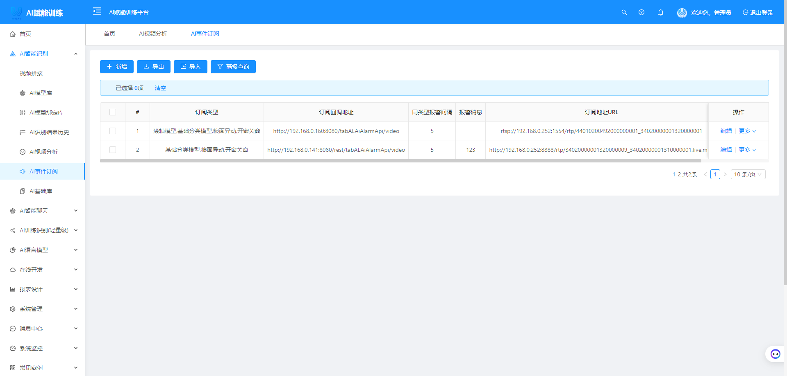
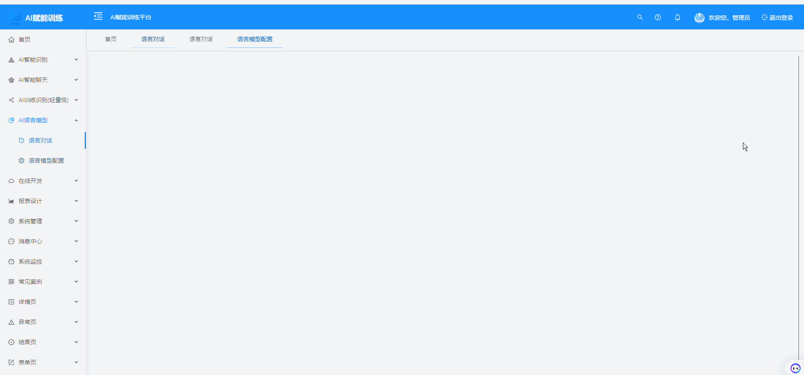
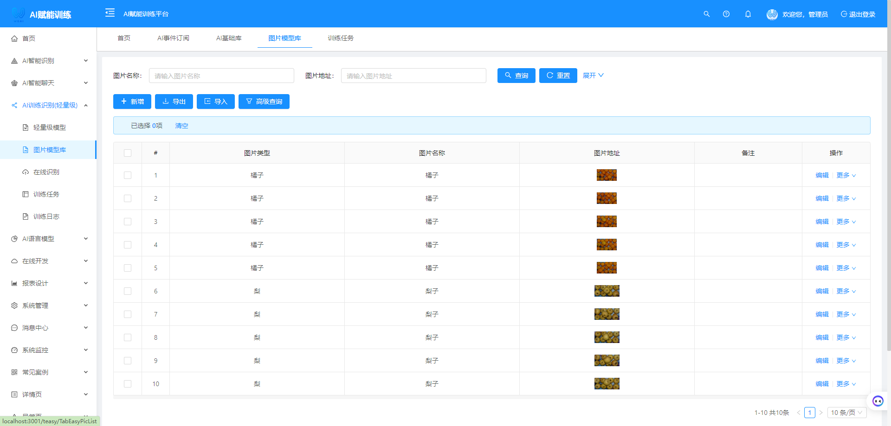

<div align="center">

# Java AI Studio
### 企业级人工智能开发平台

[](LICENSE)
[](https://www.oracle.com/java/)
[](https://spring.io/projects/spring-boot)
[](https://vuejs.org/)

[🚀 在线演示](http://116.198.227.105:8888/) | [📖 官方文档](http://116.198.227.105/#/) | [💬 技术交流](#联系我们)

</div>

## 🎯 项目概述

Java AI Studio 是一个开箱即用的企业级人工智能开发平台，集成了先进的计算机视觉、自然语言处理和机器学习技术。平台采用模块化架构设计，支持离线部署，为企业提供完整的AI解决方案。

### 🌟 核心特性

- **🔍 计算机视觉**：集成 OpenCV、YOLO (v3/v5/v8)、EasyAI 等主流视觉算法
- **💬 智能对话**：支持 ChatGPT 集成和自定义语言模型
- **🎯 模型管理**：训练与推理分离，优化资源利用
- **📊 实时监控**：Redis、JVM、系统资源全方位监控
- **🔌 API 集成**：RESTful API 支持第三方系统无缝接入
- **🏢 企业级**：支持国产化数据库，满足企业安全合规要求

### 🎮 在线体验

- **演示地址**：[http://116.198.227.105:8888/](http://116.198.227.105:8888/)
- **测试账号**：`wgai` / `wgai@2024`
- **注意事项**：演示环境资源有限，请合理使用

## 🚀 快速开始

### 📋 技术栈

- **后端**：Spring Boot 3.x + MySQL 8.0+
- **前端**：Vue 3.x + Element Plus
- **AI 框架**：OpenCV、YOLO、EasyAI
- **数据库**：支持 MySQL、PostgreSQL 等主流数据库及国产化数据库

### 📦 获取源码

```bash
# Gitee (推荐国内用户)
git clone https://gitee.com/wggh_admin/wgai.git

# GitHub
git clone https://github.com/YeyuchenBa/wgai.git
```

### ⚡ 一键部署

```bash
# 1. 启动后端服务
mvn spring-boot:run

# 2. 启动前端服务 (切换到 VUE 分支)
git checkout vue
npm install && npm run dev
```

> 💡 **提示**：建议具备 Java 基础知识后使用本平台，前端代码位于 VUE 分支

## 🎉 最新功能

### 🎤 语音识别系统
支持实时语音识别和静态音频文件处理，为无 HTTPS 环境提供完整解决方案。

<div align="center">
  
  
  
</div>

### 🚗 智能车牌识别
高精度识别蓝牌、绿牌、黄牌、白牌等各类车牌，支持实时视频流处理。

<div align="center">
  
</div>

### 📄 OCR 文字识别
基于深度学习的 OCR 引擎，文字识别准确率高达 95%，支持多种文档格式。

<div align="center">
  
</div>

## 🔧 核心功能模块

### 📊 智能监控中心
实时监控系统关键指标，包括 Redis 状态、JVM 性能、CPU 使用率等，确保系统稳定运行。

<div align="center">
  
</div>

### 🧠 AI 模型管理
- **模型库管理**：支持自定义模型上传和管理
- **训练推理分离**：优化内存使用，提升系统性能
- **模型热更新**：无需重启即可更新模型

<div align="center">
  
  
</div>

### 🎯 智能识别引擎

#### 图像识别
- **响应速度**：平均识别时间 < 1秒
- **API 支持**：RESTful API 便于第三方集成
- **多格式支持**：JPG、PNG、BMP 等主流图像格式

<div align="center">
  
</div>

#### 视频流识别
- **实时处理**：支持 RTSP、RTMP、FLV、FMP4 等协议
- **持续监控**：7×24小时不间断识别服务
- **多线程优化**：充分利用多核 CPU 性能

<div align="center">
  
</div>

### 🔌 企业级集成

#### API 接口服务
提供完整的 RESTful API，支持报警推送、图像识别、视频流接入等功能。

<div align="center">
  
  
</div>

#### 自定义配置
- **多语言支持**：识别结果支持中文标注
- **可视化配置**：自定义边框颜色和样式
- **持续更新**：定期发布新的预训练模型

### 💬 智能对话系统

#### ChatGPT 集成
- **多模态支持**：文本、Excel、TXT 等多种数据格式
- **场景化训练**：针对特定业务场景优化对话效果
- **API 兼容**：完全兼容 OpenAI API 标准

<div align="center">
  
</div>


### ⚡ 轻量级训练引擎

基于 [EasyAI](https://gitee.com/dromara/easyAi) 轻量级内核，提供高效的模型训练解决方案：

- **低资源消耗**：内存占用少，训练时间短
- **高效识别**：针对特定场景优化，识别准确率高
- **易于扩展**：模块化设计，支持自定义扩展

#### 训练管理界面

<div align="center">
  
  
  
</div>

### 🤖 智能对话训练平台

基于 EasyAI 内核的轻量级对话系统，支持快速训练和部署：

#### 核心功能模块

<div align="center">
  
  
  
  
</div>

#### 对话系统展示

<div align="center">
  
  
  
</div>

**功能特点**：
- **基础分类**：支持意图识别和实体提取
- **语义理解**：深度语义分析和上下文理解
- **智能问答**：基于知识库的问答系统
- **模型训练**：可视化训练界面，支持增量学习

## 🗺️ 发展路线

### 🎯 近期计划
- [ ] 支持更多 YOLO 模型版本
- [ ] 增强语音识别准确率
- [ ] 优化视频流处理性能
- [ ] 完善 API 文档和 SDK

### 🚀 长期规划
- [ ] 支持边缘计算部署
- [ ] 集成更多预训练模型
- [ ] 提供云端训练服务
- [ ] 构建开发者生态

## 🤝 贡献指南

我们欢迎所有形式的贡献，包括但不限于：

- 🐛 报告 Bug
- 💡 提出新功能建议
- 📝 改进文档
- 🔧 提交代码

## 📄 开源协议

本项目基于 [MIT License](LICENSE) 开源协议。


---

<div align="center">

**⭐ 如果这个项目对你有帮助，请给我们一个 Star！**

*让我们一起为低成本部署 AI 应用贡献力量！*

</div>


